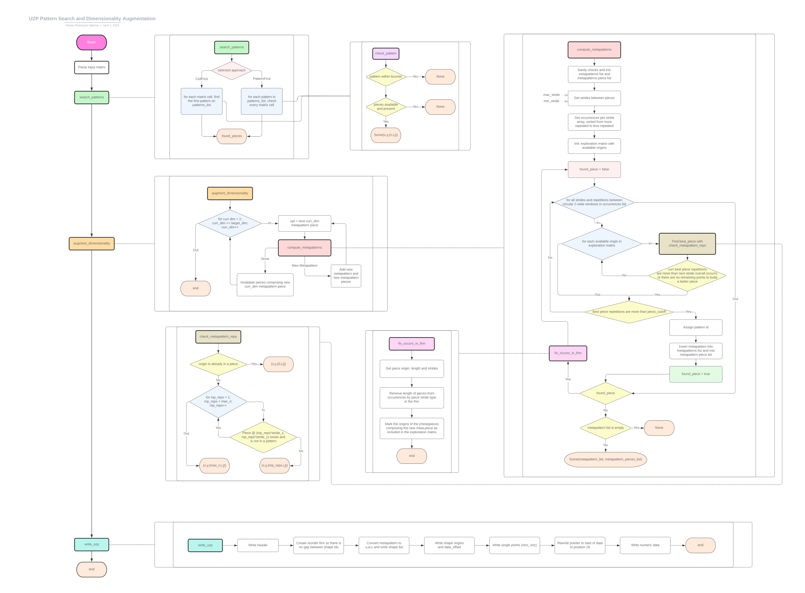

# z_polyhedrator

`z_polyhedrator` is a program for detecting regular patterns provided via a pattern file on sparse matrices.

It works with the Sparse Polyhedral Format (temporary name) and it does it quite fast. It can currently search n-D patterns in sparse matrices, export SPF files, and convert SPF files to MTX back again.
Soon, it will support reading from Rutherford Boeing files, and much faster on the fly mtx conversion, whenever the Python dependency is removed.

## Installation

You will need the latest version of the [rust toolchain](https://rustup.rs) to compile `z_polyhedrator`. Following the [Arch Linux philosophy](https://wiki.archlinux.org/title/Arch_Linux#Modernity), unless said in this README, only the latest version of the rust toolchain is supported. To use the python utils you will also need [python3(.11.2)](https://www.python.org/downloads/) installed and in the $PATH, along with all packages from `utils/requirements.txt` installed.

Before opening an Issue, check that your rust toolchain is updated (`rustup update`), and both your `python` distribution alongside with its `pip` packages are too.

### Debug build
To build the debug version the next command can be run
```bash
cargo build
```

However, compiling for debug only does not make any sense unless actual debugging is required. Most of the times, a simple run of the program is desired. To achiveve this, the command below can be used
```bash
cargo run -- <flags>
```

### Optimized build
To make a release build you can just run
```bash
cargo build --release
```

Optionally, to compile to the C equivalent of `-march=native` compilation must be performed with these flags set:
```bash
RUSTFLAGS="-C opt-level=3 -C target-cpu=native" cargo build --release
```
Whereas the PowerShell equivalent would be:
```powershell
$env:RUSTFLAGS = "-C opt-level=3 -C target-cpu=native"; cargo build --release
```


## Usage
Debug and release builds are located inside the `target` folder, like below. Needless to say, release builds must be used if good speed is desired, as in this case tend to perform around 20 to 100 times faster.
```bash
# Debug build can be executed with
./target/debug/z_polyhedrator <flags>

# Release build can be executed with
./target/release/z_polyhedrator <flags>
```

### Command line options
Help on command line options can be obtained by adding `--help` to the cmdline. A sample (and not necessarilly updated) help output is as below:
```
./target/release/z_polyhedrator --help
OPTIONS:
    -h, --help
      Prints help information.

SUBCOMMANDS:

z_polyhedrator search
  Search for (meta)patterns in a matrixmarket file. Optionally augment dimensionality and write to SPF file.

  ARGS:
    <patterns_file_path>
      File containing pattern list

    <matrixmarket_file_path>
      Input MatrixMarket file

  OPTIONS:
    --print-pattern-list
      Print patterns parsed from pattern list

    --print-ast-list
      Print 1D piece list (AST list) before any dimensionality augmentation

    --print-uwc-list
      Print uwc and distinct uwc lists after dimensionality augmentation

    -ti, --transpose-input
      Transpose matrix at input

    -to, --transpose-output
      Transpose matrix at output

    --search-flags <search_flags>
      [2D SEARCH] Search Flags. Valid options: {[PatternFirst], CellFirst} where [] = default.

    -w, --write-spf <output_spf_file_path>
      Write to custom SPF file. By default writes to matrix_market_file.mtx.spf

    -a, --augment-dimensionality <augment_dimensionality>
      Augment dimensionality

    -pl, --augment-dimensionality-piece-cutoff <augment_dimensionality_piece_cutoff>
      Minimum piece length for dimensionality augmentation

    -psmin, --augment-dimensionality-piece-stride-min <augment_dimensionality_piece_stride_min>
      Min stride for augment dimensionality search

    -psmax, --augment-dimensionality-piece-stride-max <augment_dimensionality_piece_stride_max>
      Max stride for augment dimensionality search


z_polyhedrator convert
  Convert SPF file to MTX file, in either CSC or CSR format

  ARGS:
    <input_spf_file_path>
      Input SPF file

    <output_mtx_file_path>
      Output mtx file

  OPTIONS:
    --csc
      Output in csc format (default)

    --csr
      Output in csr format


z_polyhedrator convert_timing
  Convert SPF file to MTX file, in either CSC or CSR format. Modified into a overall slower version for timing purposes (CPU and Disk operations separated in time)

  ARGS:
    <input_spf_file_path>
      Input SPF file

    <output_mtx_file_path>
      Output mtx file

  OPTIONS:
    --csc
      Output in csc format (default)

    --csr
      Output in csr format
```

### Example
If let's say, we wanted to execute `z_polyhedrator` for `Maragal_1` sparse matrix, the command would be as follows:
```bash
# While on a coding and/or debugging environment
cargo run -- search ./data/patterns.txt ./data/sparse/Maragal_1/Maragal_1.mtx

# Looking for performance
./target/release/z_polyhedrator.exe search ./data/patterns.txt ./data/sparse/Maragal_1/Maragal_1.mtx
```

However, you will notice that these commands produce no output. Some frequent use cases can be:

#### Printing AST list
```bash
./target/release/z_polyhedrator.exe search ./data/patterns.txt ./data/sparse/Maragal_1/Maragal_1.mtx --print-ast-list
```

#### Writing to SPF file
```bash
./target/release/z_polyhedrator.exe search ./data/patterns.txt ./data/sparse/Maragal_1/Maragal_1.mtx -w Maragal_1.spf
```

#### Mixed usage
Needless to say, flags can be combined unless explicitly said. For example, in order to obtain more information about the data transformation process, several flags can be specified at the same time.
```bash
./target/release/z_polyhedrator.exe search ./data/patterns.txt ./data/sparse/Maragal_1/Maragal_1.mtx -w Maragal_1.spf --print-ast-list --print-uwc-list --print-pattern-list
```

#### Converting SPF to MatrixMarket
You may want to go the other way around. You can do so with the convert subcommand.
```bash
./target/release/z_polyhedrator.exe convert ./impcol_2.2d.spf output_impcol_2.mtx
```

## Main features flowchart
<p align="center"></a></p>

## Contributing
Pull requests are welcome. For major changes, please open an issue first
to discuss what you would like to change.

## License
[TO BE DECIDED. All Rights Reserved for now](https://www.youtube.com/watch?v=SEGLhUZRZdY)
